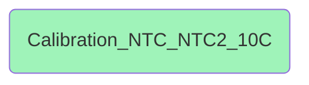
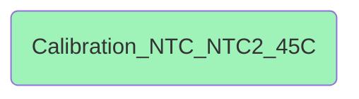
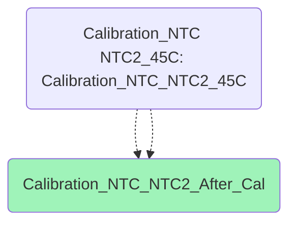
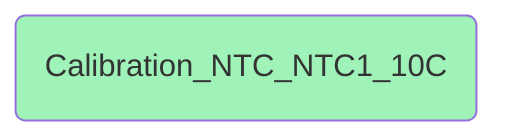
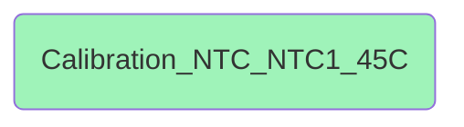
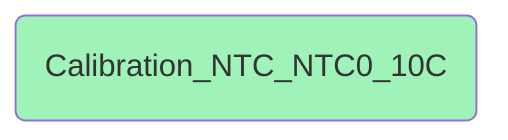
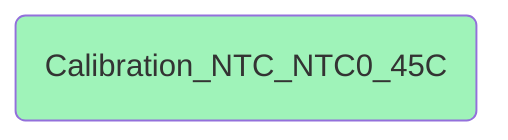
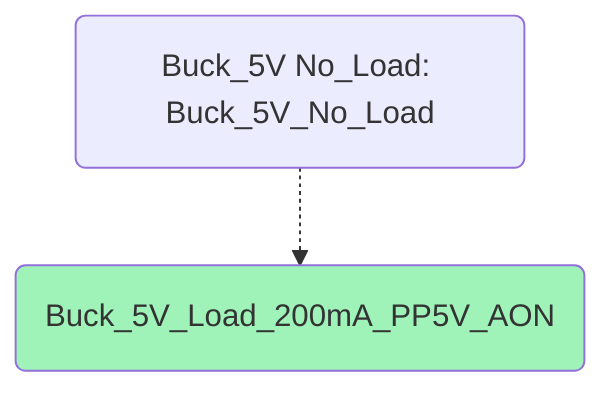

```mermaid
flowchart
    T1[<a href='#audit-fixture-hardwarecheck'>Fixture HardwareCheck</a>]
    T2[<a href='#audit-power_off-resistance'>POWER_OFF Resistance</a>]
    T1 --> T2
    T3[<a href='#audit-power_off-leakage'>POWER_OFF Leakage</a>]
    T2 --> T3
    T4[<a href='#audit-system_info-sys_rst_current'>System_Info SYS_RST_CURRENT</a>]
    T3 --> T4
    T5[<a href='#audit-system_info-sys_power'>System_Info SYS_POWER</a>]
    T4 --> T5
    T6[<a href='#audit-system_info-sys_info'>System_Info SYS_Info</a>]
    T5 --> T6
    T7[<a href='#audit-system_info-nrf_ntc'>System_Info NRF_NTC</a>]
    T6 --> T7
    T8[<a href='#audit-calibration_ntc-ntc2_10c'>Calibration_NTC NTC2_10C</a>]
    T7 --> T8
    T9[<a href='#audit-calibration_ntc-ntc2_45c'>Calibration_NTC NTC2_45C</a>]
    T8 --> T9
    T10[<a href='#audit-calibration_ntc-ntc2_after_cal'>Calibration_NTC NTC2_After_Cal</a>]
    T9 --> T10
    T11[<a href='#audit-calibration_ntc-ntc1_10c'>Calibration_NTC NTC1_10C</a>]
    T10 --> T11
    T12[<a href='#audit-calibration_ntc-ntc1_45c'>Calibration_NTC NTC1_45C</a>]
    T11 --> T12
    T13[<a href='#audit-calibration_ntc-ntc1_after_cal'>Calibration_NTC NTC1_After_Cal</a>]
    T12 --> T13
    T14[<a href='#audit-calibration_ntc-ntc0_10c'>Calibration_NTC NTC0_10C</a>]
    T13 --> T14
    T15[<a href='#audit-calibration_ntc-ntc0_45c'>Calibration_NTC NTC0_45C</a>]
    T14 --> T15
    T16[<a href='#audit-calibration_ntc-ntc0_after_cal'>Calibration_NTC NTC0_After_Cal</a>]
    T15 --> T16
    T17[<a href='#audit-buck_5v-no_load'>Buck_5V No_Load</a>]
    T16 --> T17
    T18[<a href='#audit-buck_5v-load_200ma_pp5v_aon'>Buck_5V Load_200mA_PP5V_AON</a>]
    T17 --> T18
    T19[<a href='#audit-buck_3v3-no_load'>Buck_3V3 No_Load</a>]
    T18 --> T19
    T20[<a href='#audit-buck_3v3-load_200ma_pp3v3_pdc'>Buck_3V3 Load_200mA_PP3V3_PDC</a>]
    T19 --> T20
    T21[<a href='#audit-buck_1v8-load_10ma_1v8'>Buck_1V8 Load_10mA_1V8</a>]
    T20 --> T21
    T22[<a href='#audit-buck_1v8-load_200ma_1v8_aon'>Buck_1V8 Load_200mA_1V8_AON</a>]
    T21 --> T22
    T23[<a href='#audit-i2c_device_scan-i2c_scan'>I2C_Device_Scan I2C_Scan</a>]
    T22 --> T23
    T24[<a href='#audit-led-pp_vsys_i'>LED PP_VSYS_I</a>]
    T23 --> T24
    T25[<a href='#audit-led-led_white'>LED LED_WHITE</a>]
    T24 --> T25
    T26[<a href='#audit-led-led_red'>LED LED_RED</a>]
    T24 --> T26
    T25 --> T26
    T27[<a href='#audit-led-led_green'>LED LED_GREEN</a>]
    T24 --> T27
    T26 --> T27
    T28[<a href='#audit-led-led_blue'>LED LED_BLUE</a>]
    T24 --> T28
    T27 --> T28
    T29[<a href='#audit-led-pp5v_off'>LED PP5V_OFF</a>]
    T28 --> T29
    T30[<a href='#audit-halfdome-fw_rst'>HALFDOME FW_RST</a>]
    T29 --> T30
    T31[<a href='#audit-halfdome-wtd_pet'>HALFDOME WTD_PET</a>]
    T30 --> T31
    T32[<a href='#audit-halfdome-wtd_dis'>HALFDOME WTD_DIS</a>]
    T31 --> T32
    T33[<a href='#audit-halfdome-temp_rst'>HALFDOME TEMP_RST</a>]
    T32 --> T33
    T34[<a href='#audit-halfdome-btn_rst_exit_ship'>HALFDOME BTN_RST_EXIT_SHIP</a>]
    T33 --> T34
    T35[<a href='#audit-halfdome-ilim_hiz'>HALFDOME ILIM_HIZ</a>]
    T34 --> T35
    T36[<a href='#audit-buzzer-sine_2p7k_test'>Buzzer SINE_2P7K_Test</a>]
    T35 --> T36
    T37[<a href='#audit-nrf_gpio-output'>NRF_GPIO OUTPUT</a>]
    T36 --> T37
    T38[<a href='#audit-nrf_gpio-input'>NRF_GPIO INPUT</a>]
    T37 --> T38
    T39[<a href='#audit-adc_read-vbus'>ADC_READ VBUS</a>]
    T38 --> T39
    T40[<a href='#audit-adc_read-vbst'>ADC_READ VBST</a>]
    T39 --> T40

```

# Test Modes

1. [Audit](#audit)
1. [Production](#production)


## Audit

**Main Test Sequence**




**Teardown Test Sequence**


### Audit Fixture HardwareCheck

**Conditions:**

* Products: all
* Station Types: all

**Sequence:**


### Audit POWER_OFF Resistance

**Conditions:**

* Products: all
* Station Types: all

**Sequence:**


### Audit POWER_OFF Leakage

**Conditions:**

* Products: all
* Station Types: all

**Sequence:**


### Audit System_Info SYS_RST_CURRENT

**Conditions:**

* Products: all
* Station Types: all

**Sequence:**


### Audit System_Info SYS_POWER

**Conditions:**

* Products: all
* Station Types: all

**Sequence:**


### Audit System_Info SYS_Info

**Conditions:**

* Products: all
* Station Types: all

**Sequence:**


### Audit System_Info NRF_NTC

**Conditions:**

* Products: all
* Station Types: all

**Sequence:**


### Audit Calibration_NTC NTC2_10C

**Conditions:**

* Products: all
* Station Types: all

**Sequence:**


### Audit Calibration_NTC NTC2_45C

**Conditions:**

* Products: all
* Station Types: all

**Sequence:**


### Audit Calibration_NTC NTC2_After_Cal

**Conditions:**

* Products: all
* Station Types: all

**Sequence:**


### Audit Calibration_NTC NTC1_10C

**Conditions:**

* Products: all
* Station Types: all

**Sequence:**


### Audit Calibration_NTC NTC1_45C

**Conditions:**

* Products: all
* Station Types: all

**Sequence:**


### Audit Calibration_NTC NTC1_After_Cal

**Conditions:**

* Products: all
* Station Types: all

**Sequence:**


### Audit Calibration_NTC NTC0_10C

**Conditions:**

* Products: all
* Station Types: all

**Sequence:**


### Audit Calibration_NTC NTC0_45C

**Conditions:**

* Products: all
* Station Types: all

**Sequence:**


### Audit Calibration_NTC NTC0_After_Cal

**Conditions:**

* Products: all
* Station Types: all

**Sequence:**


### Audit Buck_5V No_Load

**Conditions:**

* Products: all
* Station Types: all

**Sequence:**


### Audit Buck_5V Load_200mA_PP5V_AON

**Conditions:**

* Products: all
* Station Types: all

**Sequence:**


### Audit Buck_3V3 No_Load

**Conditions:**

* Products: all
* Station Types: all

**Sequence:**

```mermaid
flowchart
    classDef actionclass fill:#9FF3B9
    A19(Buck_3V3_No_Load):::actionclass

```
### Audit Buck_3V3 Load_200mA_PP3V3_PDC

**Conditions:**

* Products: all
* Station Types: all

**Sequence:**

```mermaid
flowchart
    classDef actionclass fill:#9FF3B9
    A20(Buck_3V3_Load_200mA_PP3V3_PDC):::actionclass
    A19(Buck_3V3 No_Load: Buck_3V3_No_Load)
    A19 -.-> A20

```
### Audit Buck_1V8 Load_10mA_1V8

**Conditions:**

* Products: all
* Station Types: all

**Sequence:**

```mermaid
flowchart
    classDef actionclass fill:#9FF3B9
    A21(Buck_1V8_Load_10mA_1V8):::actionclass

```
### Audit Buck_1V8 Load_200mA_1V8_AON

**Conditions:**

* Products: all
* Station Types: all

**Sequence:**

```mermaid
flowchart
    classDef actionclass fill:#9FF3B9
    A22(Buck_1V8_Load_200mA_1V8_AON):::actionclass
    A21(Buck_1V8 Load_10mA_1V8: Buck_1V8_Load_10mA_1V8)
    A21 -.-> A22

```
### Audit I2C_Device_Scan I2C_Scan

**Conditions:**

* Products: all
* Station Types: all

**Sequence:**

```mermaid
flowchart
    classDef actionclass fill:#9FF3B9
    A23(I2C_Device_Scan_I2C_Scan):::actionclass

```
### Audit LED PP_VSYS_I

**Conditions:**

* Products: all
* Station Types: all

**Sequence:**

```mermaid
flowchart
    classDef actionclass fill:#9FF3B9
    A24(LED_PP_VSYS_I):::actionclass

```
### Audit LED LED_WHITE

**Conditions:**

* Products: all
* Station Types: all

**Sequence:**

```mermaid
flowchart
    classDef actionclass fill:#9FF3B9
    A25(LED_LED_WHITE):::actionclass
    A24(LED PP_VSYS_I: LED_PP_VSYS_I)
    A24 -.-> A25

```
### Audit LED LED_RED

**Conditions:**

* Products: all
* Station Types: all

**Sequence:**

```mermaid
flowchart
    classDef actionclass fill:#9FF3B9
    A26(LED_LED_RED):::actionclass
    A24(LED PP_VSYS_I: LED_PP_VSYS_I)
    A24 -.-> A26

```
### Audit LED LED_GREEN

**Conditions:**

* Products: all
* Station Types: all

**Sequence:**

```mermaid
flowchart
    classDef actionclass fill:#9FF3B9
    A27(LED_LED_GREEN):::actionclass
    A24(LED PP_VSYS_I: LED_PP_VSYS_I)
    A24 -.-> A27

```
### Audit LED LED_BLUE

**Conditions:**

* Products: all
* Station Types: all

**Sequence:**

```mermaid
flowchart
    classDef actionclass fill:#9FF3B9
    A28(LED_LED_BLUE):::actionclass
    A24(LED PP_VSYS_I: LED_PP_VSYS_I)
    A24 -.-> A28

```
### Audit LED PP5V_OFF

**Conditions:**

* Products: all
* Station Types: all

**Sequence:**

```mermaid
flowchart
    classDef actionclass fill:#9FF3B9
    A29(LED_PP5V_OFF):::actionclass

```
### Audit HALFDOME FW_RST

**Conditions:**

* Products: all
* Station Types: all

**Sequence:**

```mermaid
flowchart
    classDef actionclass fill:#9FF3B9
    A30(HALFDOME_FW_RST):::actionclass

```
### Audit HALFDOME WTD_PET

**Conditions:**

* Products: all
* Station Types: all

**Sequence:**

```mermaid
flowchart
    classDef actionclass fill:#9FF3B9
    A31(HALFDOME_WTD_PET):::actionclass

```
### Audit HALFDOME WTD_DIS

**Conditions:**

* Products: all
* Station Types: all

**Sequence:**

```mermaid
flowchart
    classDef actionclass fill:#9FF3B9
    A32(HALFDOME_WTD_DIS):::actionclass

```
### Audit HALFDOME TEMP_RST

**Conditions:**

* Products: all
* Station Types: all

**Sequence:**

```mermaid
flowchart
    classDef actionclass fill:#9FF3B9
    A33(HALFDOME_TEMP_RST):::actionclass

```
### Audit HALFDOME BTN_RST_EXIT_SHIP

**Conditions:**

* Products: all
* Station Types: all

**Sequence:**

```mermaid
flowchart
    classDef actionclass fill:#9FF3B9
    A34(HALFDOME_BTN_RST_EXIT_SHIP):::actionclass

```
### Audit HALFDOME ILIM_HIZ

**Conditions:**

* Products: all
* Station Types: all

**Sequence:**

```mermaid
flowchart
    classDef actionclass fill:#9FF3B9
    A35(HALFDOME_ILIM_HIZ):::actionclass

```
### Audit Buzzer SINE_2P7K_Test

**Conditions:**

* Products: all
* Station Types: all

**Sequence:**

```mermaid
flowchart
    classDef actionclass fill:#9FF3B9
    A36(Buzzer_SINE_2P7K_Test):::actionclass

```
### Audit NRF_GPIO OUTPUT

**Conditions:**

* Products: all
* Station Types: all

**Sequence:**

```mermaid
flowchart
    classDef actionclass fill:#9FF3B9
    A37(NRF_GPIO_OUTPUT):::actionclass

```
### Audit NRF_GPIO INPUT

**Conditions:**

* Products: all
* Station Types: all

**Sequence:**

```mermaid
flowchart
    classDef actionclass fill:#9FF3B9
    A38(NRF_GPIO_INPUT):::actionclass

```
### Audit ADC_READ VBUS

**Conditions:**

* Products: all
* Station Types: all

**Sequence:**

```mermaid
flowchart
    classDef actionclass fill:#9FF3B9
    A39(ADC_READ_VBUS):::actionclass

```
### Audit ADC_READ VBST

**Conditions:**

* Products: all
* Station Types: all

**Sequence:**

```mermaid
flowchart
    classDef actionclass fill:#9FF3B9
    A40(ADC_READ_VBST):::actionclass

```
### Audit Fixture Teardown

**Conditions:**

* Products: all
* Station Types: all

**Sequence:**

```mermaid
flowchart
    classDef actionclass fill:#9FF3B9
    A1(data):::actionclass
    A2(Fixture_Teardown):::actionclass
    A1 -.-> A2

```
## Production

**Main Test Sequence**

```mermaid
flowchart
    T1[<a href='#production-fixture-hardwarecheck'>Fixture HardwareCheck</a>]
    T2[<a href='#production-power_off-resistance'>POWER_OFF Resistance</a>]
    T1 --> T2
    T3[<a href='#production-power_off-leakage'>POWER_OFF Leakage</a>]
    T2 --> T3
    T4[<a href='#production-system_info-sys_rst_current'>System_Info SYS_RST_CURRENT</a>]
    T3 --> T4
    T5[<a href='#production-system_info-sys_power'>System_Info SYS_POWER</a>]
    T4 --> T5
    T6[<a href='#production-system_info-sys_info'>System_Info SYS_Info</a>]
    T5 --> T6
    T7[<a href='#production-system_info-nrf_ntc'>System_Info NRF_NTC</a>]
    T6 --> T7
    T8[<a href='#production-calibration_ntc-ntc2_10c'>Calibration_NTC NTC2_10C</a>]
    T7 --> T8
    T9[<a href='#production-calibration_ntc-ntc2_45c'>Calibration_NTC NTC2_45C</a>]
    T8 --> T9
    T10[<a href='#production-calibration_ntc-ntc2_after_cal'>Calibration_NTC NTC2_After_Cal</a>]
    T9 --> T10
    T11[<a href='#production-calibration_ntc-ntc1_10c'>Calibration_NTC NTC1_10C</a>]
    T10 --> T11
    T12[<a href='#production-calibration_ntc-ntc1_45c'>Calibration_NTC NTC1_45C</a>]
    T11 --> T12
    T13[<a href='#production-calibration_ntc-ntc1_after_cal'>Calibration_NTC NTC1_After_Cal</a>]
    T12 --> T13
    T14[<a href='#production-calibration_ntc-ntc0_10c'>Calibration_NTC NTC0_10C</a>]
    T13 --> T14
    T15[<a href='#production-calibration_ntc-ntc0_45c'>Calibration_NTC NTC0_45C</a>]
    T14 --> T15
    T16[<a href='#production-calibration_ntc-ntc0_after_cal'>Calibration_NTC NTC0_After_Cal</a>]
    T15 --> T16
    T17[<a href='#production-buck_5v-no_load'>Buck_5V No_Load</a>]
    T16 --> T17
    T18[<a href='#production-buck_5v-load_200ma_pp5v_aon'>Buck_5V Load_200mA_PP5V_AON</a>]
    T17 --> T18
    T19[<a href='#production-buck_3v3-no_load'>Buck_3V3 No_Load</a>]
    T18 --> T19
    T20[<a href='#production-buck_3v3-load_200ma_pp3v3_pdc'>Buck_3V3 Load_200mA_PP3V3_PDC</a>]
    T19 --> T20
    T21[<a href='#production-buck_1v8-load_10ma_1v8'>Buck_1V8 Load_10mA_1V8</a>]
    T20 --> T21
    T22[<a href='#production-buck_1v8-load_200ma_1v8_aon'>Buck_1V8 Load_200mA_1V8_AON</a>]
    T21 --> T22
    T23[<a href='#production-i2c_device_scan-i2c_scan'>I2C_Device_Scan I2C_Scan</a>]
    T22 --> T23
    T24[<a href='#production-led-pp_vsys_i'>LED PP_VSYS_I</a>]
    T23 --> T24
    T25[<a href='#production-led-led_white'>LED LED_WHITE</a>]
    T24 --> T25
    T26[<a href='#production-led-led_red'>LED LED_RED</a>]
    T24 --> T26
    T25 --> T26
    T27[<a href='#production-led-led_green'>LED LED_GREEN</a>]
    T24 --> T27
    T26 --> T27
    T28[<a href='#production-led-led_blue'>LED LED_BLUE</a>]
    T24 --> T28
    T27 --> T28
    T29[<a href='#production-led-pp5v_off'>LED PP5V_OFF</a>]
    T28 --> T29
    T30[<a href='#production-halfdome-fw_rst'>HALFDOME FW_RST</a>]
    T29 --> T30
    T31[<a href='#production-halfdome-wtd_pet'>HALFDOME WTD_PET</a>]
    T30 --> T31
    T32[<a href='#production-halfdome-wtd_dis'>HALFDOME WTD_DIS</a>]
    T31 --> T32
    T33[<a href='#production-halfdome-temp_rst'>HALFDOME TEMP_RST</a>]
    T32 --> T33
    T34[<a href='#production-halfdome-btn_rst_exit_ship'>HALFDOME BTN_RST_EXIT_SHIP</a>]
    T33 --> T34
    T35[<a href='#production-halfdome-ilim_hiz'>HALFDOME ILIM_HIZ</a>]
    T34 --> T35
    T36[<a href='#production-buzzer-sine_2p7k_test'>Buzzer SINE_2P7K_Test</a>]
    T35 --> T36
    T37[<a href='#production-nrf_gpio-output'>NRF_GPIO OUTPUT</a>]
    T36 --> T37
    T38[<a href='#production-nrf_gpio-input'>NRF_GPIO INPUT</a>]
    T37 --> T38
    T39[<a href='#production-adc_read-vbus'>ADC_READ VBUS</a>]
    T38 --> T39
    T40[<a href='#production-adc_read-vbst'>ADC_READ VBST</a>]
    T39 --> T40

```


**Teardown Test Sequence**

```mermaid
flowchart
    T1[<a href='#production-fixture-teardown'>Fixture Teardown</a>]

```


### Production Fixture HardwareCheck

**Conditions:**

* Products: all
* Station Types: all

**Sequence:**

```mermaid
flowchart
    classDef actionclass fill:#9FF3B9
    A1(Fixture_HardwareCheck):::actionclass

```
### Production POWER_OFF Resistance

**Conditions:**

* Products: all
* Station Types: all

**Sequence:**

```mermaid
flowchart
    classDef actionclass fill:#9FF3B9
    A2(POWER_OFF_Resistance):::actionclass

```
### Production POWER_OFF Leakage

**Conditions:**

* Products: all
* Station Types: all

**Sequence:**

```mermaid
flowchart
    classDef actionclass fill:#9FF3B9
    A3(POWER_OFF_Leakage):::actionclass

```
### Production System_Info SYS_RST_CURRENT

**Conditions:**

* Products: all
* Station Types: all

**Sequence:**

```mermaid
flowchart
    classDef actionclass fill:#9FF3B9
    A4(System_Info_SYS_RST_CURRENT):::actionclass

```
### Production System_Info SYS_POWER

**Conditions:**

* Products: all
* Station Types: all

**Sequence:**

```mermaid
flowchart
    classDef actionclass fill:#9FF3B9
    A5(System_Info_SYS_POWER):::actionclass

```
### Production System_Info SYS_Info

**Conditions:**

* Products: all
* Station Types: all

**Sequence:**

```mermaid
flowchart
    classDef actionclass fill:#9FF3B9
    A6(System_Info_SYS_Info):::actionclass

```
### Production System_Info NRF_NTC

**Conditions:**

* Products: all
* Station Types: all

**Sequence:**

```mermaid
flowchart
    classDef actionclass fill:#9FF3B9
    A7(System_Info_NRF_NTC):::actionclass

```
### Production Calibration_NTC NTC2_10C

**Conditions:**

* Products: all
* Station Types: all

**Sequence:**

```mermaid
flowchart
    classDef actionclass fill:#9FF3B9
    A8(Calibration_NTC_NTC2_10C):::actionclass

```
### Production Calibration_NTC NTC2_45C

**Conditions:**

* Products: all
* Station Types: all

**Sequence:**

```mermaid
flowchart
    classDef actionclass fill:#9FF3B9
    A9(Calibration_NTC_NTC2_45C):::actionclass

```
### Production Calibration_NTC NTC2_After_Cal

**Conditions:**

* Products: all
* Station Types: all

**Sequence:**

```mermaid
flowchart
    classDef actionclass fill:#9FF3B9
    A10(Calibration_NTC_NTC2_After_Cal):::actionclass
    A9(Calibration_NTC NTC2_45C: Calibration_NTC_NTC2_45C)
    A9 -.-> A10
    A9(Calibration_NTC NTC2_45C: Calibration_NTC_NTC2_45C)
    A9 -.-> A10

```
### Production Calibration_NTC NTC1_10C

**Conditions:**

* Products: all
* Station Types: all

**Sequence:**

```mermaid
flowchart
    classDef actionclass fill:#9FF3B9
    A11(Calibration_NTC_NTC1_10C):::actionclass

```
### Production Calibration_NTC NTC1_45C

**Conditions:**

* Products: all
* Station Types: all

**Sequence:**

```mermaid
flowchart
    classDef actionclass fill:#9FF3B9
    A12(Calibration_NTC_NTC1_45C):::actionclass

```
### Production Calibration_NTC NTC1_After_Cal

**Conditions:**

* Products: all
* Station Types: all

**Sequence:**

```mermaid
flowchart
    classDef actionclass fill:#9FF3B9
    A13(Calibration_NTC_NTC1_After_Cal):::actionclass
    A12(Calibration_NTC NTC1_45C: Calibration_NTC_NTC1_45C)
    A12 -.-> A13
    A12(Calibration_NTC NTC1_45C: Calibration_NTC_NTC1_45C)
    A12 -.-> A13

```
### Production Calibration_NTC NTC0_10C

**Conditions:**

* Products: all
* Station Types: all

**Sequence:**

```mermaid
flowchart
    classDef actionclass fill:#9FF3B9
    A14(Calibration_NTC_NTC0_10C):::actionclass

```
### Production Calibration_NTC NTC0_45C

**Conditions:**

* Products: all
* Station Types: all

**Sequence:**

```mermaid
flowchart
    classDef actionclass fill:#9FF3B9
    A15(Calibration_NTC_NTC0_45C):::actionclass

```
### Production Calibration_NTC NTC0_After_Cal

**Conditions:**

* Products: all
* Station Types: all

**Sequence:**

```mermaid
flowchart
    classDef actionclass fill:#9FF3B9
    A16(Calibration_NTC_NTC0_After_Cal):::actionclass
    A15(Calibration_NTC NTC0_45C: Calibration_NTC_NTC0_45C)
    A15 -.-> A16
    A15(Calibration_NTC NTC0_45C: Calibration_NTC_NTC0_45C)
    A15 -.-> A16

```
### Production Buck_5V No_Load

**Conditions:**

* Products: all
* Station Types: all

**Sequence:**

```mermaid
flowchart
    classDef actionclass fill:#9FF3B9
    A17(Buck_5V_No_Load):::actionclass

```
### Production Buck_5V Load_200mA_PP5V_AON

**Conditions:**

* Products: all
* Station Types: all

**Sequence:**

```mermaid
flowchart
    classDef actionclass fill:#9FF3B9
    A18(Buck_5V_Load_200mA_PP5V_AON):::actionclass
    A17(Buck_5V No_Load: Buck_5V_No_Load)
    A17 -.-> A18

```
### Production Buck_3V3 No_Load

**Conditions:**

* Products: all
* Station Types: all

**Sequence:**

```mermaid
flowchart
    classDef actionclass fill:#9FF3B9
    A19(Buck_3V3_No_Load):::actionclass

```
### Production Buck_3V3 Load_200mA_PP3V3_PDC

**Conditions:**

* Products: all
* Station Types: all

**Sequence:**

```mermaid
flowchart
    classDef actionclass fill:#9FF3B9
    A20(Buck_3V3_Load_200mA_PP3V3_PDC):::actionclass
    A19(Buck_3V3 No_Load: Buck_3V3_No_Load)
    A19 -.-> A20

```
### Production Buck_1V8 Load_10mA_1V8

**Conditions:**

* Products: all
* Station Types: all

**Sequence:**

```mermaid
flowchart
    classDef actionclass fill:#9FF3B9
    A21(Buck_1V8_Load_10mA_1V8):::actionclass

```
### Production Buck_1V8 Load_200mA_1V8_AON

**Conditions:**

* Products: all
* Station Types: all

**Sequence:**

```mermaid
flowchart
    classDef actionclass fill:#9FF3B9
    A22(Buck_1V8_Load_200mA_1V8_AON):::actionclass
    A21(Buck_1V8 Load_10mA_1V8: Buck_1V8_Load_10mA_1V8)
    A21 -.-> A22

```
### Production I2C_Device_Scan I2C_Scan

**Conditions:**

* Products: all
* Station Types: all

**Sequence:**

```mermaid
flowchart
    classDef actionclass fill:#9FF3B9
    A23(I2C_Device_Scan_I2C_Scan):::actionclass

```
### Production LED PP_VSYS_I

**Conditions:**

* Products: all
* Station Types: all

**Sequence:**

```mermaid
flowchart
    classDef actionclass fill:#9FF3B9
    A24(LED_PP_VSYS_I):::actionclass

```
### Production LED LED_WHITE

**Conditions:**

* Products: all
* Station Types: all

**Sequence:**

```mermaid
flowchart
    classDef actionclass fill:#9FF3B9
    A25(LED_LED_WHITE):::actionclass
    A24(LED PP_VSYS_I: LED_PP_VSYS_I)
    A24 -.-> A25

```
### Production LED LED_RED

**Conditions:**

* Products: all
* Station Types: all

**Sequence:**

```mermaid
flowchart
    classDef actionclass fill:#9FF3B9
    A26(LED_LED_RED):::actionclass
    A24(LED PP_VSYS_I: LED_PP_VSYS_I)
    A24 -.-> A26

```
### Production LED LED_GREEN

**Conditions:**

* Products: all
* Station Types: all

**Sequence:**

```mermaid
flowchart
    classDef actionclass fill:#9FF3B9
    A27(LED_LED_GREEN):::actionclass
    A24(LED PP_VSYS_I: LED_PP_VSYS_I)
    A24 -.-> A27

```
### Production LED LED_BLUE

**Conditions:**

* Products: all
* Station Types: all

**Sequence:**

```mermaid
flowchart
    classDef actionclass fill:#9FF3B9
    A28(LED_LED_BLUE):::actionclass
    A24(LED PP_VSYS_I: LED_PP_VSYS_I)
    A24 -.-> A28

```
### Production LED PP5V_OFF

**Conditions:**

* Products: all
* Station Types: all

**Sequence:**

```mermaid
flowchart
    classDef actionclass fill:#9FF3B9
    A29(LED_PP5V_OFF):::actionclass

```
### Production HALFDOME FW_RST

**Conditions:**

* Products: all
* Station Types: all

**Sequence:**

```mermaid
flowchart
    classDef actionclass fill:#9FF3B9
    A30(HALFDOME_FW_RST):::actionclass

```
### Production HALFDOME WTD_PET

**Conditions:**

* Products: all
* Station Types: all

**Sequence:**

```mermaid
flowchart
    classDef actionclass fill:#9FF3B9
    A31(HALFDOME_WTD_PET):::actionclass

```
### Production HALFDOME WTD_DIS

**Conditions:**

* Products: all
* Station Types: all

**Sequence:**

```mermaid
flowchart
    classDef actionclass fill:#9FF3B9
    A32(HALFDOME_WTD_DIS):::actionclass

```
### Production HALFDOME TEMP_RST

**Conditions:**

* Products: all
* Station Types: all

**Sequence:**

```mermaid
flowchart
    classDef actionclass fill:#9FF3B9
    A33(HALFDOME_TEMP_RST):::actionclass

```
### Production HALFDOME BTN_RST_EXIT_SHIP

**Conditions:**

* Products: all
* Station Types: all

**Sequence:**

```mermaid
flowchart
    classDef actionclass fill:#9FF3B9
    A34(HALFDOME_BTN_RST_EXIT_SHIP):::actionclass

```
### Production HALFDOME ILIM_HIZ

**Conditions:**

* Products: all
* Station Types: all

**Sequence:**

```mermaid
flowchart
    classDef actionclass fill:#9FF3B9
    A35(HALFDOME_ILIM_HIZ):::actionclass

```
### Production Buzzer SINE_2P7K_Test

**Conditions:**

* Products: all
* Station Types: all

**Sequence:**

```mermaid
flowchart
    classDef actionclass fill:#9FF3B9
    A36(Buzzer_SINE_2P7K_Test):::actionclass

```
### Production NRF_GPIO OUTPUT

**Conditions:**

* Products: all
* Station Types: all

**Sequence:**

```mermaid
flowchart
    classDef actionclass fill:#9FF3B9
    A37(NRF_GPIO_OUTPUT):::actionclass

```
### Production NRF_GPIO INPUT

**Conditions:**

* Products: all
* Station Types: all

**Sequence:**

```mermaid
flowchart
    classDef actionclass fill:#9FF3B9
    A38(NRF_GPIO_INPUT):::actionclass

```
### Production ADC_READ VBUS

**Conditions:**

* Products: all
* Station Types: all

**Sequence:**

```mermaid
flowchart
    classDef actionclass fill:#9FF3B9
    A39(ADC_READ_VBUS):::actionclass

```
### Production ADC_READ VBST

**Conditions:**

* Products: all
* Station Types: all

**Sequence:**

```mermaid
flowchart
    classDef actionclass fill:#9FF3B9
    A40(ADC_READ_VBST):::actionclass

```
### Production Fixture Teardown

**Conditions:**

* Products: all
* Station Types: all

**Sequence:**

```mermaid
flowchart
    classDef actionclass fill:#9FF3B9
    A1(data):::actionclass
    A2(Fixture_Teardown):::actionclass
    A1 -.-> A2

```
